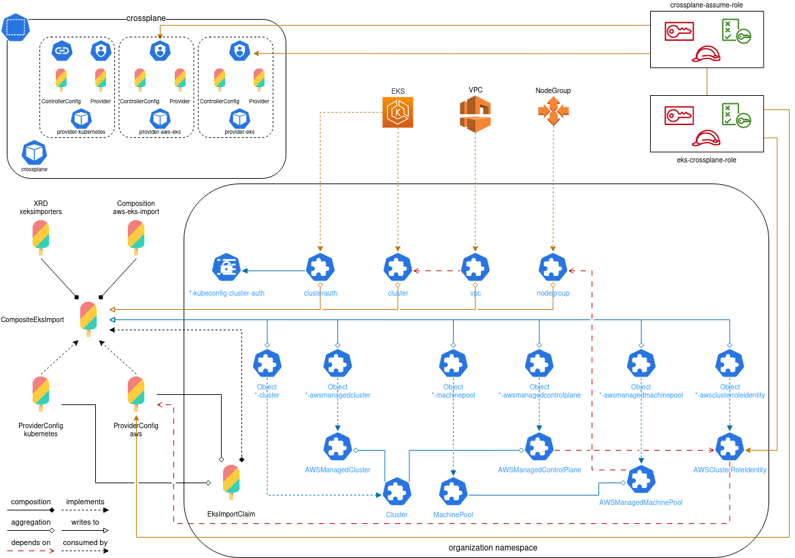

# EKS cluster Import to Cluster API



In order for existing EKS clusters to be imported into Cluster API this
set of Composite resources exists to facilitate the creation of CAPI resources
inside the Kubernetes management cluster.

This works in three parts. Crossplane Observation, resource creation, CAPI
Observation.

We're going to focus primarily on the crossplane observation and resource
creation as these are the only elements that can be controlled.

If you're new to crossplane and wish to get an understanding of how the
components work together, please see the [composition breakdown](./docs/composition-breakdown.md)
document.

## Prerequisites

The EKS cluster must have the tag `kubernetes.io/cluster/CLUSTER_NAME` where
`CLUSTER_NAME` is the name of your EKS cluster.

If this tag does not exist, CAPA complains on import and will report this back
on the status of the `AWSManagedControlPlane`.

The nodegroup must have the tag `kubernetes.io/cluster/CLUSTER_NAME: owned`

## Crossplane Observation

In order to import EKS clusters, crossplane needs three pieces of information
from the customer.

- The region the cluster is built in
- The cluster name
- The nodegroup name

The XRD then creates `ObserveOnly` resources for the EKS Cluster, the VPC
derived from the cluster and the Nodegroup.

Additionally to this crossplane will also create a secret containing the cluster
authentication information although this information is also subsequently
gathered by CAPI and not actually required as anything other than an back door.
We may choose to drop the creation of this object in future.

## IAM Permissions

In order to collect information from AWS, crossplane requires read only
permissions for EKS and some EC2 resources.

CAPI requires an enhanced permission set that includes some write actions for
tagging and security group creation.

For a breakdown of the permissions used by this composition, please see the
document [iam-permissions](./docs/iam-permissions.md).

## Providers

For crossplane to be able to read from AWS and create Kubernetes objects, the
following providers must be installed.

- `upbound/provider-aws-ec2`
  - installed with `--enableManagementPolicies`
- `upbound/provider-aws-eks`
  - installed with `--enableManagementPolicies`
- `crossplane-contrib/provider-kubernetes`

To install and configure the cloud providers, please see the documentation in
[`management-cluster-bases`](https://github.com/giantswarm/management-cluster-bases/tree/main/extras/crossplane)

To install and configure the `kubernetes provider, please see the documentation
on [setting up provider-kubernetes](./docs/install-kubernetes-provider.md)

### IRSA configuration for AWS crossplane providers

IRSA must be configured on the service account linked to each of the pods in the
`provider-aws` family. For instructions on how to set this up, please see the
documentation [Using `crossplane` with IAM Roles for Service Accounts](https://github.com/giantswarm/management-cluster-bases/tree/main/extras/crossplane/providers/upbound/aws#using-crossplane-with-iam-roles-for-service-accounts).

Once the provider pods have been installed, a secondary role needs to be created
for both crossplane and CAPI to bind on to. For documentation on setting up that
role, please see the [Secondary role instructions](./docs/secondary-role-instructions.md)

## Installation

Once crossplane has been configured correctly and all providers installed, the
next step is to  install the XRDs. These must exist first before binding any
claims to them.

**Note** The instructions given here will be manual but these may be done with
fluxcd in a real installation scenario. See [installing with fluxcd](./docs/installing-with-fluxcd.md)
for instructions on how to achieve this.

```bash
k apply -f xrd
```

Next, we need to apply the provider config.

Edit the [`providerconfig.yaml`](./providerconfig.yaml) file and set the account
id to that of the account you are installing this in. Then apply the file

```bash
k apply -f providerconfig.yaml
```

Finally edit the claim and apply this.

```bash
k apply -f aws-claim.yaml
```

## Claim settings

Most of the claim can actually be left alone if you've followed this from the
top and used defaults for the names. Instead, the key fields to change are:

- `spec.namespace` This should be set to the namespace you wish your resources
  to be created in.
- `spec.parameters.clusterName` Set this to the name of the cluster you are
  importing.
- `spec.parameters.nodeGroupName` Set this to the name of the nodegroup attached
  to the cluster.

## Cluster Deletion

When deleting a cluster that is managed by external resources, this seems to get
stuck actually trying to delete the cluster which the policy will not allow it
to do.

In this instance it is safe to remove the finalisers from all stuck objects.

- AWSManagedMachinePool
- AWSManagedControlPlane
- Cluster

## Troubleshooting

With crossplane managed resources it's often hard to understand exactly where
to start when troubleshooting errors.

The easiest way to understand this is to follow the chain down from the
`Composition`.

Start by describing the composition kind and looking for errors on the status.

For example, as part of this repository, the composition kind is
`CompositeEksImport` and has the name composed of the elements `${clusterName}-XXXXX`
where XXXXX is a unique 5 character identifier.

Errors on the composition kind commonly occur when expected resources are not
created and are often the result of patching failures to/from unexpected or
non-existant fields.

A successfully applied composition kind should have events similar to the
following:

```nohighlight
Type    Reason             Age                    From                                                             Message
----    ------             ----                   ----                                                             -------
Normal  ComposeResources   38m (x737 over 12h)    defined/compositeresourcedefinition.apiextensions.crossplane.io  Successfully composed resources
Normal  SelectComposition  3m33s (x772 over 12h)  defined/compositeresourcedefinition.apiextensions.crossplane.io  Successfully selected composition
```

If the composition fails to yield any errors then the next place to look is at
the claim type which in this instance would be `EksImportClaim ${clusterName}`

Both the claim type and the composition kind should have an identical reflection
of any patched fields using the type `ToCompositeFieldPath`. This means that
either can be used to validate the information you're patching between resources
may be used to validate the information is correct.

The claim may not show any events as these are normally trapped by the
composition kind.

If neither of these two locations reveals any issues, then you need to start
following the resources created by the claim.

For kubernetes resources there are two types created, first the `Object` type,
then the type the `Object` implements.

If the object implementation has been created, check it for errors. If it has not
then the object may offer details on why it's not building the resource.

For non-kubernetes objects (e.g. those generated by the AWS family providers),
then any errors should show up in the status of those resources.

When all else fails, check the logs for the related components, for example
logs for Nodegroup objects will show up in the logs for
`crossplane:provider-aws-eks`.
