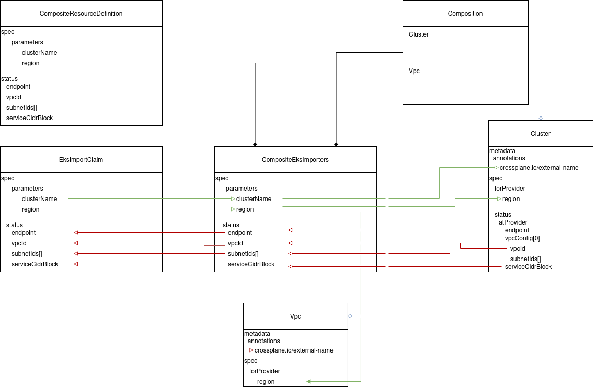
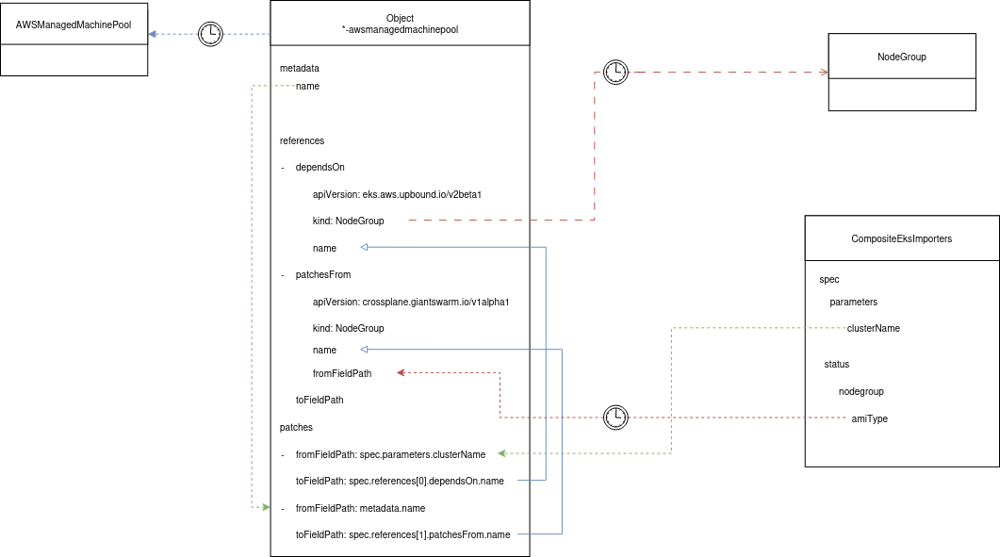

# Composition breakdown

To better understand what is going on inside the [`composition`](../xrd/composition.yaml)
file, this document breaks down each component in order to better explain the
process from an architectural perspective, showing where information is coming
from and going to.

Inside our [`CompositeResourceDefinition`](../xrd/definition.yaml) we define a
number of fields we require to be populated from the claim, and a number that
are to be populated into the status field. As the claim is applied, information
flows between the composition and the claim as data is applied and retrieved.

To better understand what compositions are, please see the [crossplane
documentation on this topic](https://docs.crossplane.io/latest/concepts/compositions/)

## Selectors

So the claim selects the correct composition, this implementation defines two
specific labels. `component` and `provider` .

These are used inside the claim to retrieve the correct composition that is
required for building EKS imports

```yaml
    compositionSelector:
      matchLabels:
        component: ...
        provider: ...
```

Any crossplane composition must provide unique label values to support placing
multiple compositions behind a single definition without the risk of incorrectly
selecting an invalid composition for the claim type.

## Patch Sets

The composition defines 3 distinct patch sets.

- metadata
- awsConfig
- kubernetesConfig

There is a patch set shared amongst all providers (metadata) and a patchset for
each unique provider group.

When defining patchsets you must take care to ensure there is no duplication of
values between patchsets where multiple patchsets will be applied to a composite
resource. If this becomes the case, the last applied patch wins and may result
in an incorrectly patched resource.

For more information on patchsets please see the [documentation on this topic](https://docs.crossplane.io/latest/concepts/compositions/#patch-sets)

## Resources

Each resource is made up of 3 parts, a name, a base and patches.

- `name` This can be anything as long as it's unique. This is used by crossplane
  internals to identify the different composite resources on the stack.
- `base` The base consists of the composite resource specification. This in
  turn can be broken down into:

  - `apiVersion`
  - `kind`
  - `metadata`
  - `spec` where for the purposes of resource creation, `spec` consists of
    two primary elements that are required for the patching.
    - `forProvider` This is information we will give to the resource for it to
      be created or managed inside the target environment
    - `status.atProvider` This is information crossplane discovers about the
      resource inside the target environment.
- `patches` The capability of taking information from one place and writing it
  to another.

## Patching

Although relatively straightforward, patching is probably the most daunting part
of writing crossplane resources. This is generally because even a simple XRD
may require many patches to create resources inside it.

This complexity can be compounded when working with the `kubernetes` provider
as it defines its own patching methods which can in turn be patched by crossplane
internals.

### Crossplane patching

For any given resource patching crossplane provides two patching types.

- `FromCompositeFieldPath` This is the default when not specified and it used
  to take information from the composition and pass this to the current
  composite resource.
- `ToCompositeFieldPath` This takes information from the composite resource and
  hands this back to the composition.

To try and give you an idea of how this works, see the following diagram
summarized from the interactions between two of the composite resouurces, the
composition, XRD and claim.



### Kubernetes patching

When handling kubernetes objects, the patching strategy becomes more complex.
This is the result of the `provider-kubernetes` Object type allowing additional
patching that can enforce dependencies between objects and ensure that reference
types are created before the referencing object is.

For a more thorough breakdown of how this works see the [enhanced provider
documentation](https://github.com/crossplane-contrib/provider-kubernetes/blob/main/docs/enhanced-provider-k8s.md)

Within this composition, we can see the complexity of this in the
AWSManagedMachinePool object which is the last one in the file.

Here, we create a set of references which are dependencies and patches between
other objects created inside the cluster.

Whilst these do not have to be objects created by Kubernetes, in this instance
each of them is.

To abbreviate this, we can consider the following yaml:

```yaml
    - name: awsmanagedmachinepool
      base:
        apiVersion: kubernetes.crossplane.io/v1alpha1
        kind: Object
        spec:
          references:
            - dependsOn:
                apiVersion: eks.aws.upbound.io/v2beta1
                kind: NodeGroup
            - patchesFrom:
                apiVersion: crossplane.giantswarm.io/v1alpha1
                kind: CompositeEksImport
                fieldPath: status.nodegroup.amiType
              toFieldPath: spec.amiType
            - patchesFrom:
                apiVersion: crossplane.giantswarm.io/v1alpha1
                kind: CompositeEksImport
                fieldPath: status.nodegroup.capacityType
              toFieldPath: spec.capacityType
```

Here, we create a set of references as `apiVersion` and `kind`, where patchesFrom
also have additional `fromFieldPath` and `toFieldPath`. It's important to note
the locations of these. `toFieldPath` is at the same level as the `patchesFrom`
entry. This will be a path on the provider manifest.

The second difference here is that the `toFieldPath` is a reference to a location
on the final manifest, it is not a location on the `provider-kubernetes::Object`
type.

These references force the Object to wait before creation to ensure that all
patched fields can be populated, however this is incomplete.

You will notice from each reference that there is a name missing. As we don't
know this name until creation, we cannot patch it with kubernetes object
references and instead this must be populated by the crossplane patching strategy.


